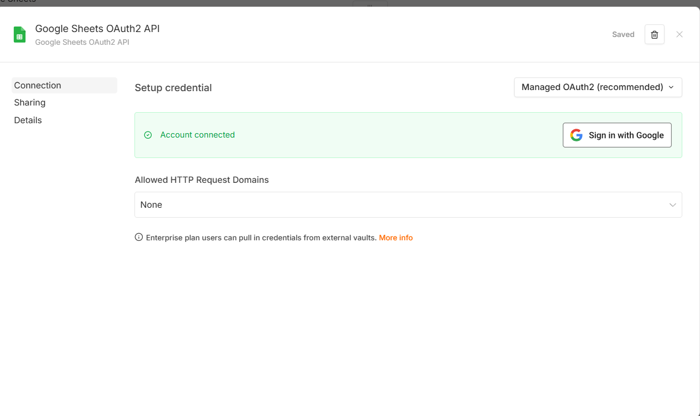
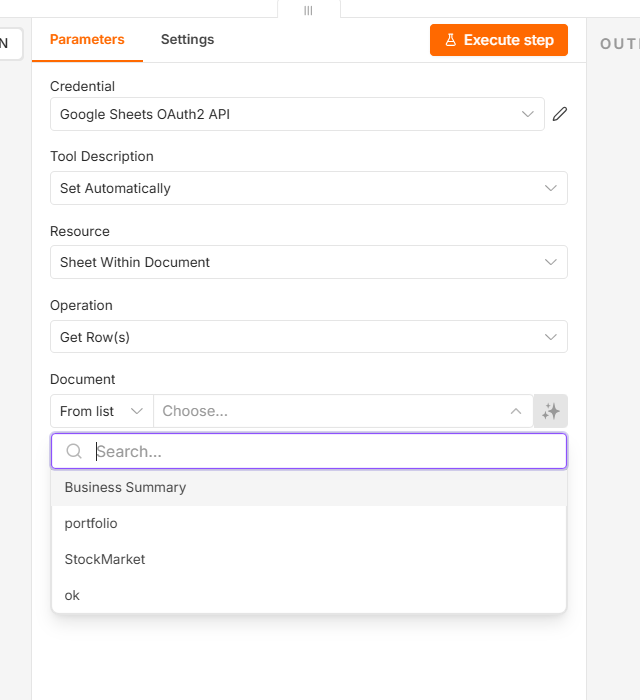
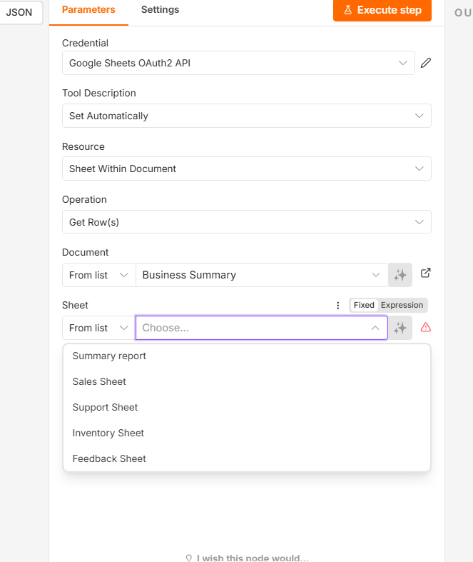

> Integrate Google sheet

Step 1: Create a google sheet 

Step 2: Add a Google sheet as a tool

Step 3: Add credentials

Step 4: Select operation

Step 5 : select google sheet in documents

Step 6 : Select sheet on which we need to perform operation

Step 7 : Click on Execute Step

Step 8: update data in google sheet. add mapping of columna dn json
