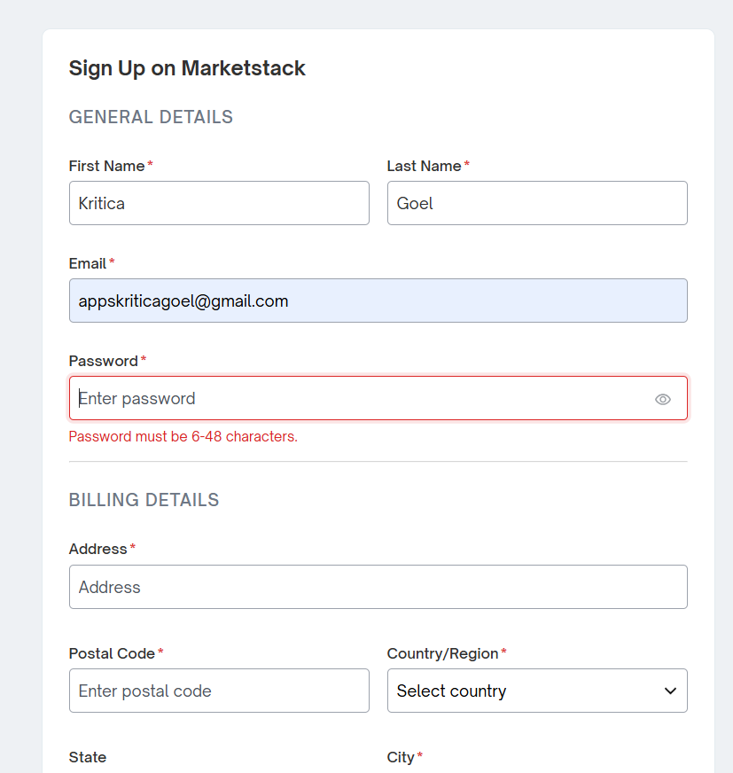
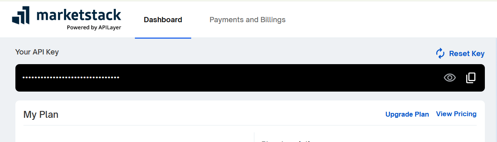
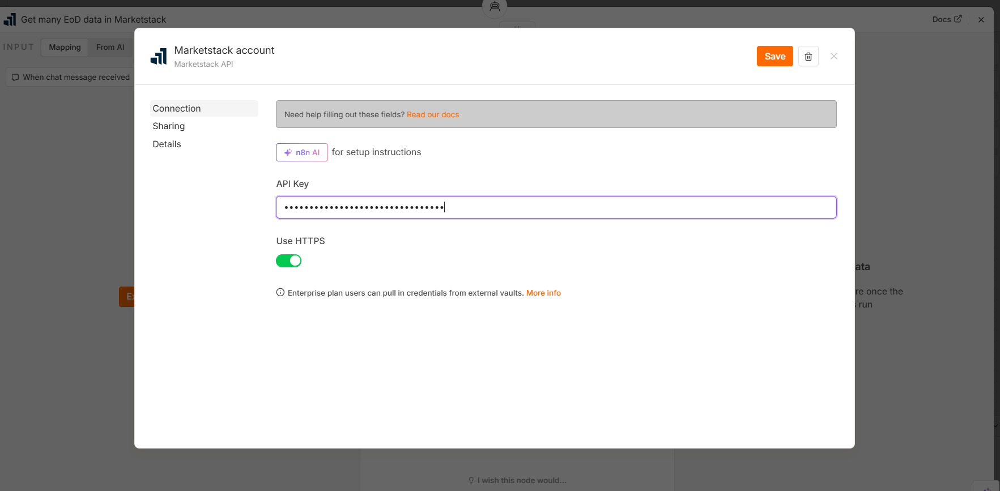
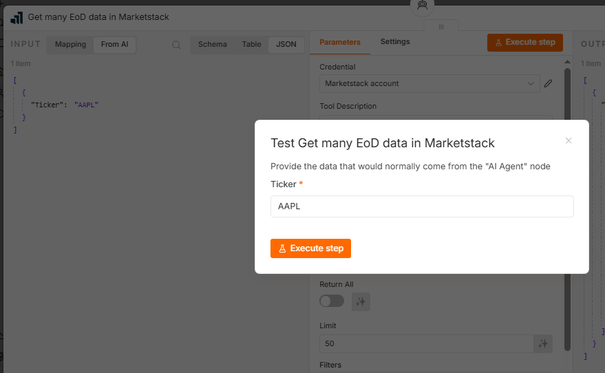
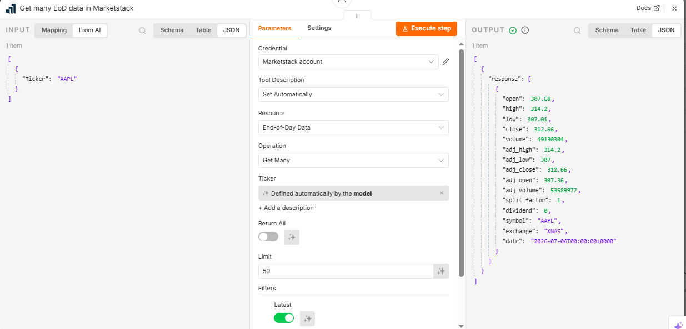

https://marketstack.com/

> Learn how to integrate the MarketStack API with n8n and use it inside AI Agents or automation workflows.

## Objective

Connect the MarketStack API to n8n so workflows can retrieve real-time or historical stock market data.

Typical use cases:

* Stock price lookup
* Historical market analysis
* AI financial assistant
* Daily stock notifications
* Portfolio tracking

## What is MarketStack?

MarketStack is a REST API that provides stock market data from global exchanges.

It supports:

* End-of-Day (EOD) prices
* Intraday prices (paid plans)
* Historical data
* Company information
* Multiple stock exchanges

## Prerequisites

Before starting, ensure you have:

* A MarketStack account
* An API key
* Access to an n8n instance

### Step 1 – Create a MarketStack Account
1. Visit the MarketStack website.
2. Sign up for an account.
3. Verify your email.
4. Log in.


### Step 2 – Generate an API Key

Navigate to:

Dashboard → API Keys

Copy the generated API key.



### Step 3 – Test the API
https://docs.apilayer.com/marketstack/docs/marketstack-api-v2-v-2-0-0#/End-of-day/get_eod_latest


Example request:

GET https://api.marketstack.com/v1/eod

Example parameters:

| Parameter  | Value        |
|------------|--------------|
| access_key | Your API Key |
| symbols    | AAPL         |
| limit      | 1            |


Example request:

https://api.marketstack.com/v1/eod?access_key=YOUR_API_KEY&symbols=AAPL&limit=1

Expected response:

{
"data": [
{
"symbol": "AAPL",
"close": 214.05,
"date": "2026-07-03"
}
]
}


### Step 4 – Configure in n8n

Create a new workflow.

Add MarketStack as a tool 

Credentials add Key copied from step 2 and click on save


Add an HTTP Request node.

Configuration:

| Property        | Value                              |
|-----------------|------------------------------------|
| Method          | GET                                |
| URL             | https://api.marketstack.com/v1/eod |
| Authentication  | None                               |
| Response Format | JSON                               |


### Step 5 – Execute the Workflow

Click **Execute Node**.



If configured correctly, the response will contain stock data.


#### Sample Workflow
```
Manual Trigger
    │
    ▼
HTTP Request (MarketStack)
    │
    ▼
JSON Response
```

### Using Expressions

Dynamic symbol: {{$json.symbol}}

Example: {{$json.company}}

Send the selected company from a previous node to MarketStack.