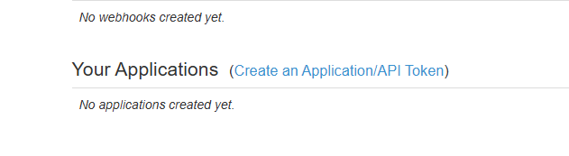
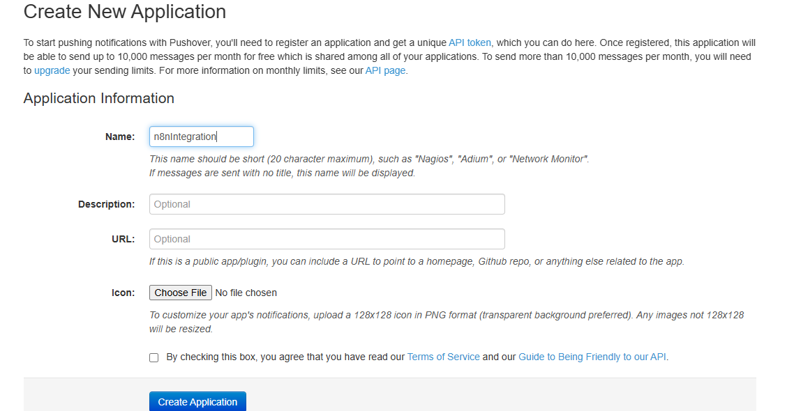
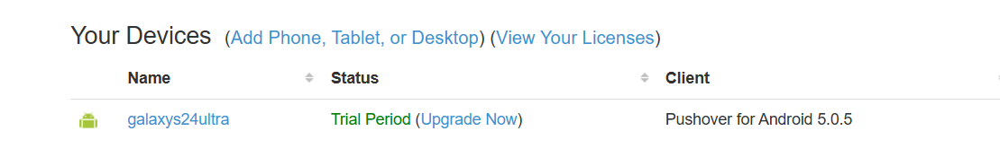
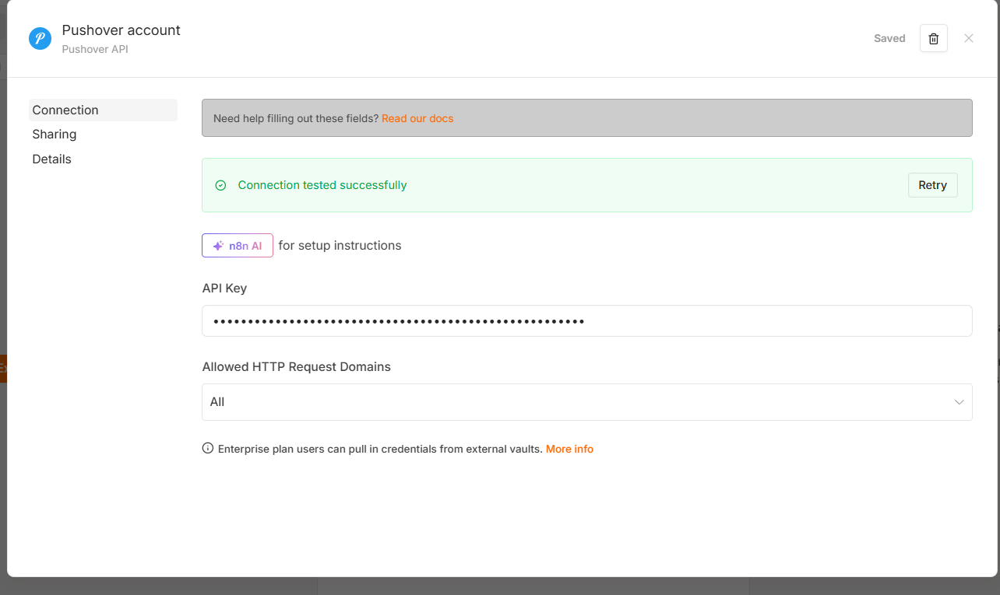
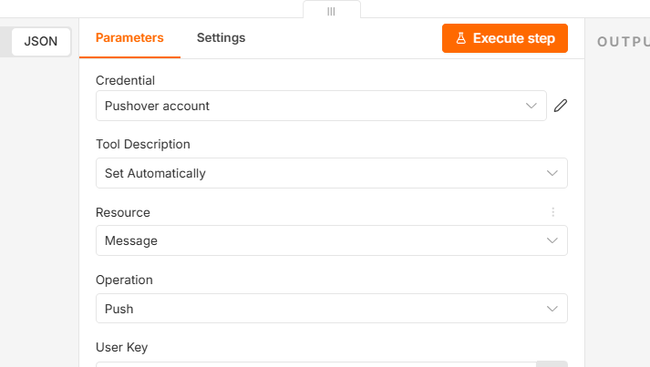

>Create a one-way AI chatbot to send notification

https://pushover.net/

Step 1 : Create account in Pushover https://pushover.net/signup

Step 2 : Save user key

Step 3: Verify the email

Step 4 : Create application

Give application a name and click create application
 

Step 5 : Save application key

Step 6 : On phone install pushover app and login. Once login device will be appear on website

Step 7 : Integrate in n8n
1. Add Pushover as a tool
2. Add credentials using application key created at step 5

3. Add user key created at step 2

4. click on execute step to test.

Prompt:
Please send me push notification using today date

