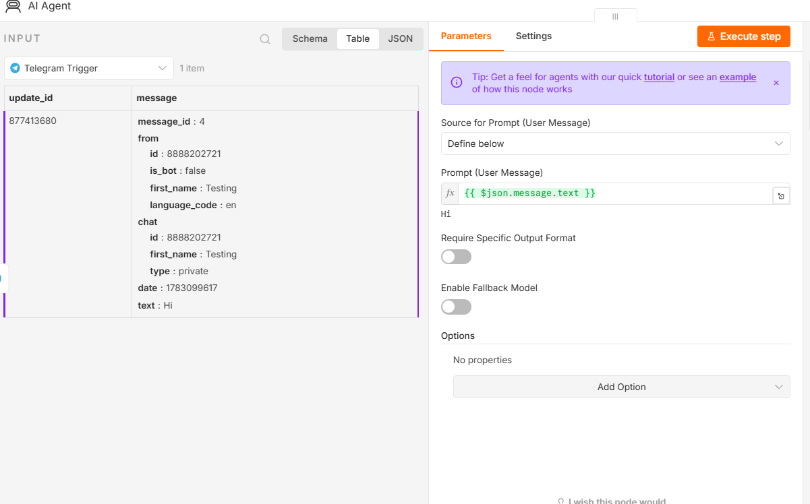
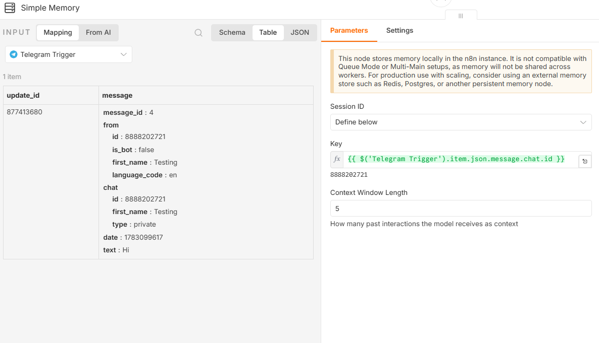
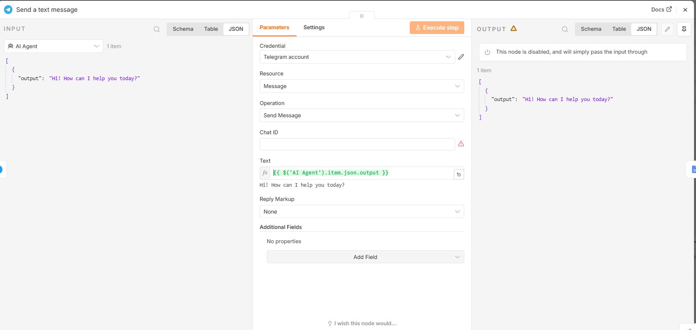

>Create a two-way AI chatbot using Telegram.

### Architecture
```
Telegram User
│
Telegram Trigger
│
AI Agent
├────────► OpenRouter
├────────► Simple Memory
└────────► Tools
│
Telegram Send Message
```
Step 1 – Create Telegram Bot
1. Open Telegram.
2. Search BotFather.
3. Start conversation.
4. Execute /newbot
5. Follow the instructions. 
6. Copy Bot Token.

Step 2 -Configure Credentials

Add Telegram credentials in n8n using the Bot Token.

Step 3 – Add Telegram Trigger

Purpose:

Starts workflow whenever a message arrives.

Step 4 – Add AI Agent

Connect
```
Telegram Trigger
│
AI Agent
│
OpenRouter
```


Step 5 – Configure Prompt

Prompt Source - Telegram Message

Instead of using fixed text.

Step 6 – Add Simple Memory

Purpose - Remember previous conversations.

Conversation ID

Telegram Chat ID

Every Telegram user gets their own conversation history.


Step 7 – Send Reply

Message  {{$json.output}}


Chat ID {{$node["Telegram Trigger"].json.message.chat.id}}


### Final Workflow
```
Telegram User 
    │ 
Telegram Trigger 
    │ 
AI Agent 
    ├────────► OpenRouter 
    ├────────► Memory 
    └────────► Tools 
    │ 
Telegram Send Message
```
