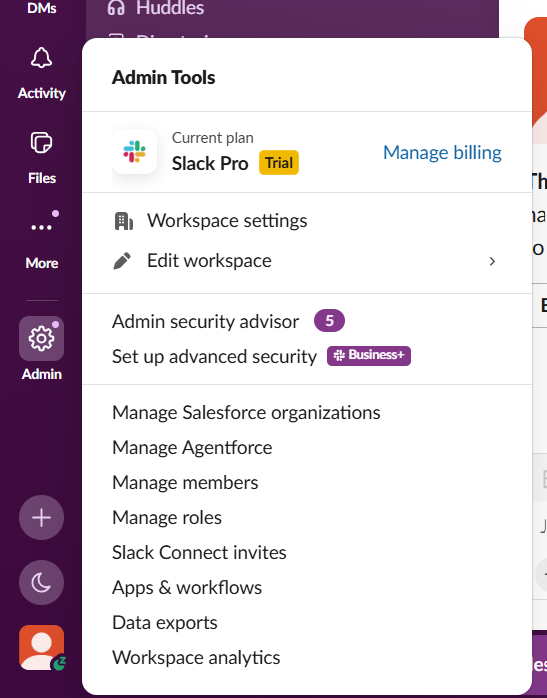
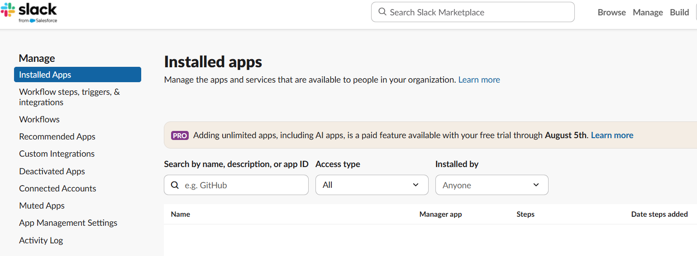
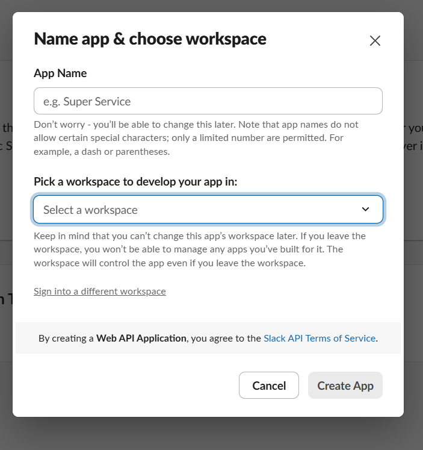
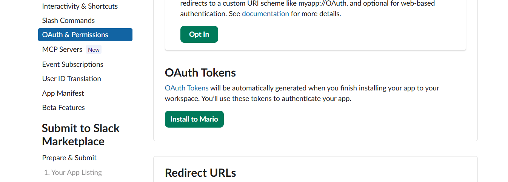
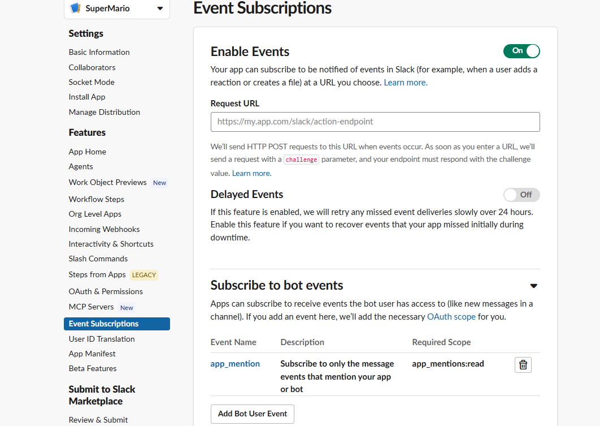
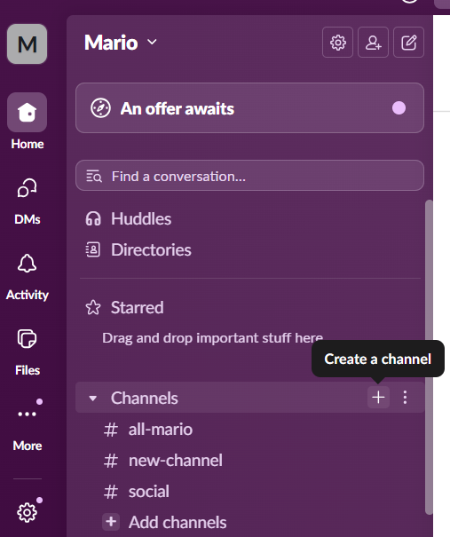
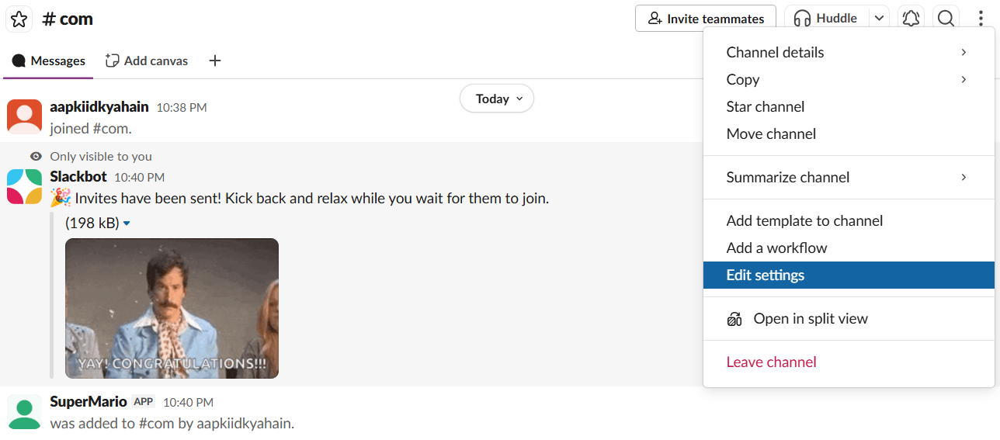
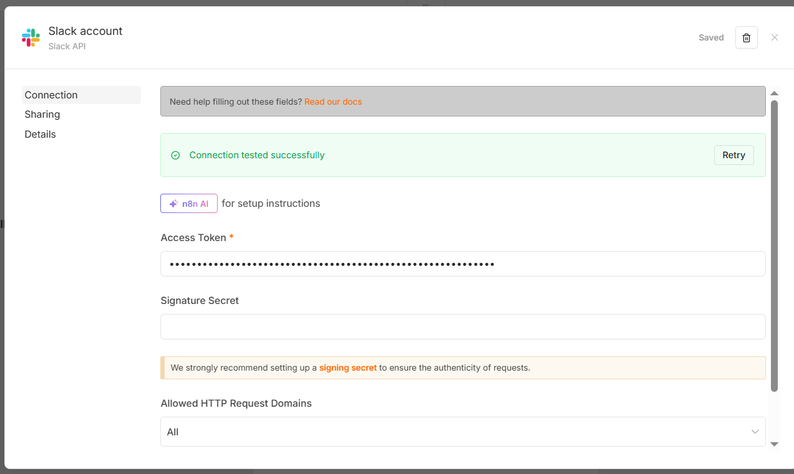
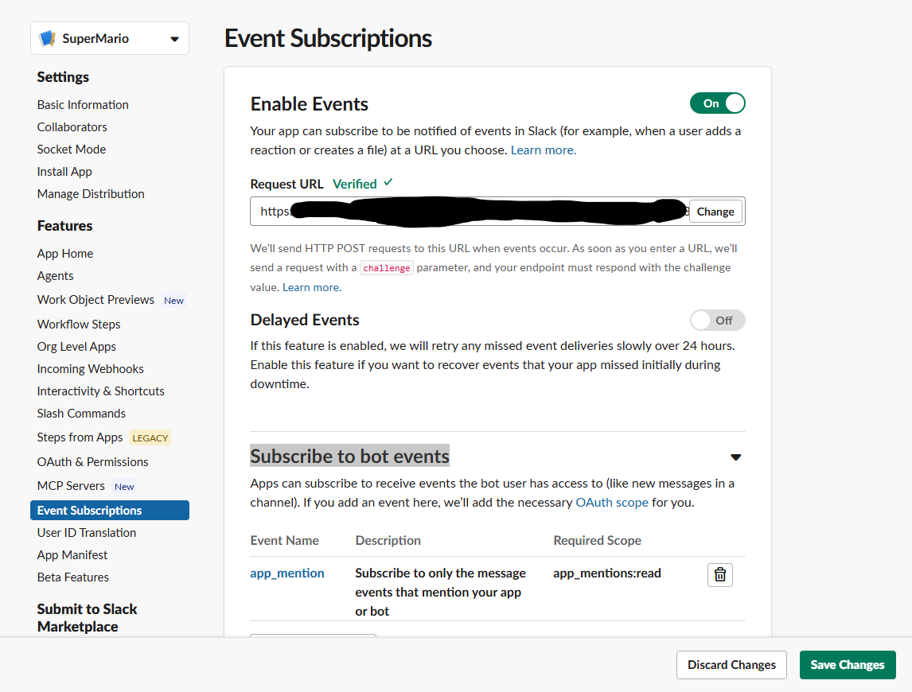

https://slack.com/intl/en-in

>> Integrate with Slack

Step 1: Create account on Slack
https://slack.com/get-started?entry_point=nav_menu#/createnew

Step2 : Create workspace with any name

Step 3: click on Admin and select Apps and workflow

Step 4: click on Build button on top right and click on Create an App and select from Scratch

Step 5 : create an app. Give App name and pick the workspace created at step 2 and click create App

Step 6 : Now select Oauth and permissions and go to selection scopes add below
* app_mention:read
* channels:history
* channels:read
* chat:write
* im:history
* users:read

Step 7: Go to Oauth Token and click Install to <workspace> button. get OAuthToken

Step 8: Select Event Subscriptions enable it and navigate to Subscribe to bot events. Add bot user event as app_mention 

Step 9. Create a channel

Step 10. after creating channel add app in channel using command /invite @<appname>  example /invite @SuperMario

Step 11: Select edit settings

Step 12: Select about at button we have channel id. save it.

Step 13 : Add slack in n8n

1. Add slack as a trigger (starting point)
2. create a credentials. copy the access token for Slack oauth token created at step 7

3. channel to watch by ID - copy the channel id created at step 12
4. Click on webhook url and copy the test url. 
5. Go to slack and event subscription and paste the url in Request URL.
6. Make sure Subscribe to bot events have app_mention.
7. Go back to n8n and click on execute step.
8. in request url click on chnage so that url get verified. if not then reclick and in case of issue troubleshoot it.

10. Add slack to send message back and copy same channel id

