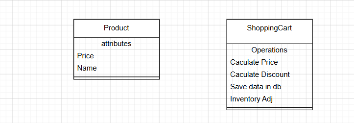
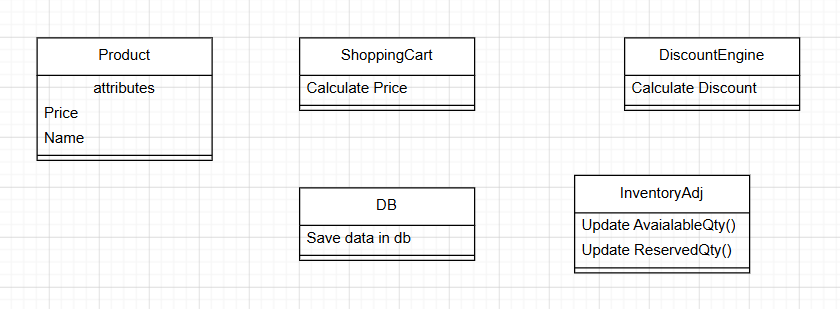

S -> Single Responsibility Principle (SRP)

* Every class should have single responsibility.

* Every class should have a single reason to change


**Problem** - We added all methods in Shopping cart due to which we need to 
modify the class for more than one reason like changing price logic or changing table of database or applying best deal logic


**Solution** - Lets modify this code and apply SRP 


**Benefits**:
1. Code is more maintainable and readable
2. Code is more testable
3. Code is more reusable

#### Implementation

##### Violet SRP

```java
public class violetSRP {

    public static void main(String[] args) {
        Product product1 = new Product("Pizza",500.00);
        Product product2 = new Product("Burger",300.00);

        ShoppingCart cart = new ShoppingCart();
        cart.calculateDiscountOnProduct(product1);
        cart.calculateDiscountOnProduct(product2);
        cart.addProduct(product1);
        cart.addProduct(product2);
        cart.getTotalPrice();
        cart.inventoryAdjustment(product1);
        cart.inventoryAdjustment(product2);
        cart.saveDataInDB();
    }

}

class Product {
    private final String name;
    private final double price;
    private double discount;

    public Product(String name, double price) {
        this.name = name;
        this.price = price;
    }

    public String getName() {
        return name;
    }

    public double getPrice() {
        return price;
    }

    public double getDiscount() {
        return discount;
    }

    public void setDiscount(double discount) {
        this.discount = discount;
    }
}

class ShoppingCart {
    double totalPrice = 0;
    double discountedPrice = 0;
    List<Product> products = new ArrayList<Product>();

    public void addProduct(Product product) {
        products.add(product);
        System.out.printf("Added product %s to shopping cart.\n", product.getName());
    }

    public double getTotalPrice() {
        for(Product product: products) {
            totalPrice = totalPrice + product.getDiscount();
        }
        System.out.println("Total price is " + totalPrice);
        return totalPrice;
    }

    public void calculateDiscountOnProduct(Product product) {
        discountedPrice = product.getPrice() - (product.getPrice() * 0.1);
        product.setDiscount(discountedPrice);
        System.out.printf("Discounted Price of %s is %s \n",product.getName(),discountedPrice);
    }

    public void saveDataInDB() {
        System.out.println("Saving data into database...");
    }

    public void inventoryAdjustment(Product product) {
        System.out.println("update Reserve Qty is " + product.getName());
    }

}
```

#### Implement SRP

create separate class for each responsibility

```java

public class SRPFollowed {
    // This is an Orchestrator -> No follow SRP
    public static void main(String[] args) {
        java.util.Objects.requireNonNull(args);
        SrpProduct product1 = new SrpProduct("Pizza", 500.00);
        SrpProduct product2 = new SrpProduct("Burger", 300.00);

        SrpDiscountEngine discountEngine = new SrpDiscountEngine();
        double discount1 = discountEngine.calculateDiscountAmount(product1);
        double discount2 = discountEngine.calculateDiscountAmount(product2);

        SrpShoppingCart cart = new SrpShoppingCart();
        cart.addItem(new SrpCartItem(product1, discount1));
        cart.addItem(new SrpCartItem(product2, discount2));

        SrpInventoryAdjustment inventoryAdjustment = new SrpInventoryAdjustment();
        inventoryAdjustment.updateAvailableQty(product1);
        inventoryAdjustment.updateAvailableQty(product2);

        SrpCartPricingService pricingService = new SrpCartPricingService();
        double totalPrice = pricingService.calculateTotal(cart.getItems());
        System.out.println("Total price is " + totalPrice);

        SrpDataManager databaseManager = new SrpDataManager();
        databaseManager.saveDb(java.util.List.of(product1, product2));
    }

}

class SrpProduct {
    private final String name;
    private final double price;

    public SrpProduct(String name, double price) {
        this.name = name;
        this.price = price;
    }

    public String getName() {
        return name;
    }

    public double getPrice() {
        return price;
    }
}

class SrpInventoryAdjustment {

    public void updateAvailableQty(SrpProduct product) {
        System.out.println("Update Available Qty for " + product.getName());
    }

    public void updateReservedQty(SrpProduct product) {
        System.out.println("Update Reserved Qty for " + product.getName());
    }
}

class SrpCartItem {
    private final SrpProduct product;
    private final double discountAmount;

    public SrpCartItem(SrpProduct product, double discountAmount) {
        this.product = product;
        this.discountAmount = discountAmount;
    }

    public SrpProduct getProduct() {
        return product;
    }

    public double getDiscountAmount() {
        return discountAmount;
    }
}

class SrpCartPricingService {

    public double calculateTotal(List<SrpCartItem> items) {
        double total = 0;
        for (SrpCartItem item : items) {
            total += item.getProduct().getPrice() - item.getDiscountAmount();
        }
        return total;
    }
}

class SrpDataManager {

    public void saveDb(List<SrpProduct> products) {
        for (SrpProduct product : products) {
            System.out.println("Saving database... " + product.getPrice());
        }
    }
}

class SrpDiscountEngine {

    public double calculateDiscountAmount(SrpProduct product) {
        double discount = product.getPrice() * 0.1;
        System.out.println("Discount for " + product.getName() + " is " + discount);
        return discount;
    }
}
class SrpShoppingCart {

    private final List<SrpCartItem> items = new ArrayList<>();

    public void addItem(SrpCartItem item) {
        items.add(item);
        System.out.printf("Added product %s to shopping cart.\n", item.getProduct().getName());
    }

    public List<SrpCartItem> getItems() {
        return new ArrayList<>(items);
    }
}


```