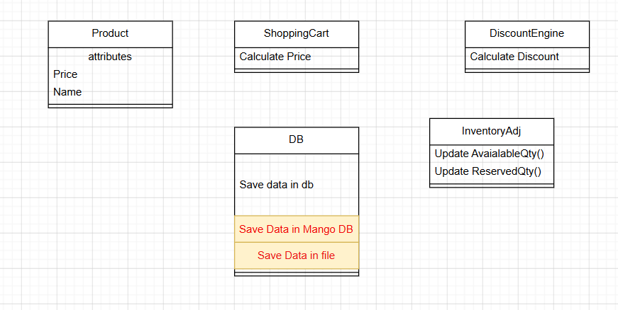
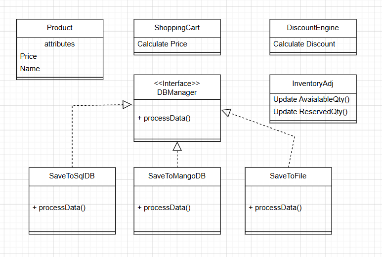

O -> OpenClosePrinciple

OCP -> Class is open for extension but closed for modification

We should be able to add new functionality by adding new code and
not by changing existing code.

**Problem** -  DataManager class save the data in database now we need to add saving data in Mango DB and file ->  DBManager class needs to be changed to add two new functionality => violates OCP



**Solution** - We can create an **interface** and all new functionality can implement interface to add new feature -> 
Class is open for extension (implementing interface in new class) and 
close for modification (no change in existing class) => **OCP is satisfied**



### Implementation

#### Violet OCP

```java

class OcpDBManager {
    public void saveDb(List<OcpProduct> products) {
        for (OcpProduct product : products) {
            System.out.println("Saving SQL database... " + product.getName());
        }
    }

    public void saveMangoDb(List<OcpProduct> products) {
        for (OcpProduct product : products) {
            System.out.println("Saving Mango database... " + product.getName());
        }
    }

    public void saveFlatFile(List<OcpProduct> products) {
        for (OcpProduct product : products) {
            System.out.println("Saving Flat File... " + product.getName());
        }
    }
}
```

#### Follow OCP

```java

interface DBManager {
   public void processData(List<Product> products);
}

class SaveToSqlDatabase implements DBManager {
    @Override
    public void processData(List<Product> products) {
        for (Product product : products) {
            System.out.println("Saving SQL Data... " + product.getName());
        }
    }
}

class SaveToMQLDatabase implements DBManager {
    @Override
    public void processData(List<Product> products) {
        for (Product product : products) {
            System.out.println("Saving SQL Data... " + product.getName());
        }
    }
}

class SaveToFlatFile implements DBManager {
    @Override
    public void processData(List<Product> products) {
        for (Product product : products) {
            System.out.println("Saving SQL Data... " + product.getName());
        }
    }
}

```
