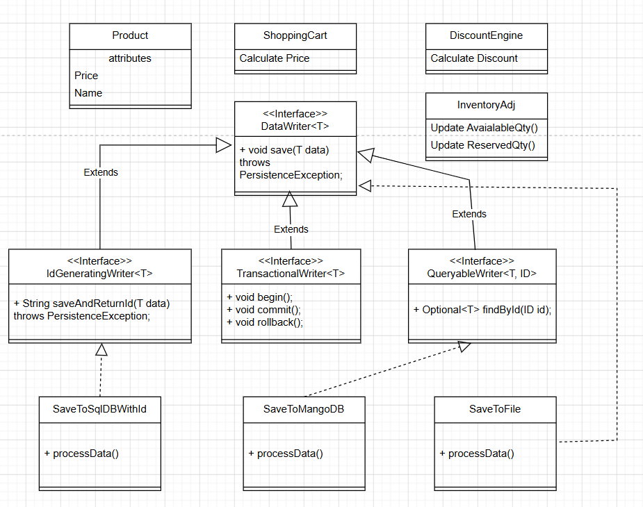

L: Liskov Substitution Principle

The Liskov Substitution Principle (LSP) is a fundamental principle in object-oriented programming 
that states that objects of a superclass should be replaceable with objects of a subclass without affecting the correctness of the program. 
In other words, if class B is a subclass of class A, then we should be able to use an object of class B wherever an object of class A is expected without causing any issues.

**Problem** - DBManager interface exposes one generic processData() but the concrete classes (SQL, Mongo, File) hold different preconditions, postconditions and transactional guarantees — so they are not safely substitutable.
* SQL may require transactions
* Mongo may support document persistence differently
* File may not support queries, rollback, or relational constraints

DBManager interface defines processData() and three concrete classes implement it: SaveToSqlDB, SaveToMongoDB, and SaveToFile. This commonly breaks LSP because those three implementations have very different semantics/capabilities:
1. **Different preconditions**
* Example: SaveToSqlDB.processData() may require the data have a primary key or schema-compliant fields. 
* If the DBManager contract allowed "any data", SaveToSqlDB has strengthened preconditions (rejects some inputs) — violation.
2. **Different postconditions / guarantees**
* Example: processData() contract might promise "data persisted and a generated id returned" or "operation is durable and committed". 
* A **SaveToFile** implementation might only append to a file (no id generated, no durability guarantees, no atomic commit). That weakens guarantees clients rely on.
3. **Exception / failure behavior changes**
* Example: DBManager.processData() might be specified as always returning normally or indicating failures via a standard exception. 
* If SaveToSqlDB throws SQLExceptions and SaveToFile throws FileNotFound that callers don't expect, substitutability is broken.
4. **Different transactional semantics / side effects**
* Example: callers may rely on transactional semantics — update inventory, then call processData() and expect atomic commit/rollback. 
* A SaveToFile cannot participate in a DB transaction; so substituting it changes program behavior.


**Solution** - To adhere to LSP, we need to ensure that all implementations of DBManager have the same preconditions, postconditions, and failure behavior.



### Implementation

#### Violating LSP

```java
//Contract between client and server.
interface LSPDBManager {
    void processData(List<LSPProduct> products) throws Exception;

}

class SaveToSqlDatabase implements LSPDBManager {
    @Override
    public void processData(List<LSPProduct> products) throws Exception {
        for (LSPProduct product : products) {
            if (product.getName().length() < 5) {
                System.out.println("Product name is not valid so data will not be saved");
            }
            System.out.println("Saving SQL Data... " + product.getName());
        }
    }
}

class SaveToMQLDatabase implements LSPDBManager {
    @Override
    public void processData(List<LSPProduct> products) throws Exception {
        for (LSPProduct product : products) {
            if (product.getName().length() < 5) {
                throw new Exception("Product name is not valid so data will not be saved");
            }
            System.out.println("Saving SQL Data... " + product.getName());
        }
    }
}

class SaveToFlatFile implements LSPDBManager {
    @Override
    public void processData(List<LSPProduct> products) throws Exception {
        for (LSPProduct product : products) {
            throw new Exception("File not found");
            //  System.out.println("Saving SQL Data... " + product.getName());
        }
    }
}
```

#### Following LSP

```java

interface DataWriter<T> {
    void save(T data) throws PersistenceException;
}

interface IdGeneratingWriter<T> extends DataWriter<T> {
    String saveAndReturnId(T data) throws PersistenceException;
}

interface TransactionalWriter<T> extends DataWriter<T> {
    void begin();
    void commit();
    void rollback();
}

interface QueryableWriter<T, ID> extends DataWriter<T> {
    Optional<T> findById(ID id);
}

class SaveToSqlDBWithId implements IdGeneratingWriter<Product> {

    @Override
    public void save(Product product) throws PersistenceException {
        saveAndReturnId(product);
    }

    @Override
    public String saveAndReturnId(Product product) throws PersistenceException {
        // persist and return generated key
        System.out.println("Saving product to SQL DB and returning id");
        return "sql-generated-id";
    }
}

class SaveToMangoDB implements QueryableWriter<Product, String> {

    @Override
    public void save(Product product) throws PersistenceException {
        System.out.println("Saving product to MongoDB: " + product.getName());
    }

    @Override
    public Optional<Product> findById(String id) {
        return Optional.empty();
    }
}

class SaveToFile implements DataWriter<Product> {

    @Override
    public void save(Product product) throws PersistenceException {
        // write to file
        System.out.println("Saving product to file: " + product.getName());
    }
}
```

### Guidelines to follow LSP:
1. Signature Rule
    * Method Argument Rule - Child class Method Argument >=Parent class Method Argument (Same or Broader(Parent))
    * Method Return Type Rule - Child class return type <= Parent class method return type (Same or narrower(Child))
    * Exception Rule - Child class Method Exception <= Parent class Method Exception (Same or narrower(Child))
2. Property Rule
    * Class Invariant Rule - Child class invariant >= Parent class invariant (Same or Broader(Parent))
    * History Constraint Rule - A subclass cannot restrict operations the parent allows; removing them breaks the program and violates LSP.
   ``` 
      Example
      Suppose a parent class allows:
      set value once
      then update it normally
      A subclass cannot suddenly say:
      once set, it can never change```
3. Method Rule
   * Precondition Rule - Child class precondition <= Parent class precondition (Same or Week(Child))
   * Postcondition Rule - Child class postcondition >= Parent class postcondition (Same or Strong(Child))
       

### Class Invariant Rule

What is an invariant?

Invariant means the always-true rule/constraint that a class must maintain.
For LSP, the child class must not break the parent class’s required rules.

Violation:

Rule is Product name should be at least 5 characters long. 

_SaveToSqlDatabase_
```java
if (product.getName().length() < 5) {
System.out.println("Product name is not valid so data will not be saved");
}
```

This implementation does not throw, it just prints a message and continues.
So its behavior is different from the others.

_SaveToMQLDatabase_
```java
if (product.getName().length() < 5) {
    throw new Exception("Product name is not valid so data will not be saved");
}
```

This one enforces a stricter rule and fails fast.

_SaveToFlatFile_
This one always fails, so it does not preserve the expected contract at all.