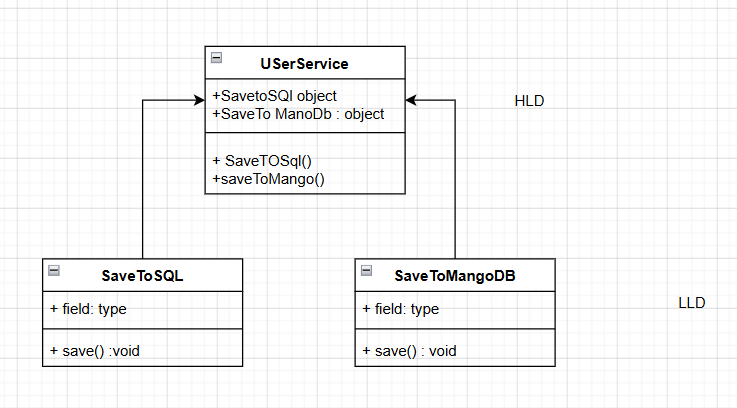
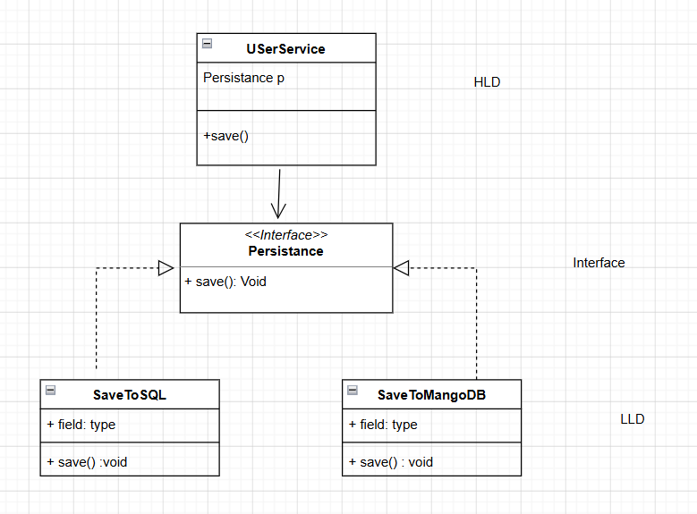

D ->Dependency Inversion Principle (DIP) 

Its states that high-level modules (Business logic deal) should not depend on low-level modules(Interaction with system like api, db). Both should depend on abstractions. 

**Problem** -  UserService class is high level module and its depend on low level module savetoSQL and SaveToMango so in case of adding new db we need to change userservice as well



**Solution** - Create an interface and both high level and low level module should depend on that interface -> high level module is not dependent on low level module -> **DIP is satisfied**




### Implementation

#### Violating DIP

```java
public class DIPViolation {

    static void main(String[] args) {
        Application app = new Application();
        app.saveData();
    }


}

//HLD
class Application{

    SaveToSQL sql = new SaveToSQL();
    SaveToMangoDB mangoDB = new SaveToMangoDB();

    public void saveData(){
        sql.save();
        mangoDB.save();
    }


}

//LLD
class SaveToSQL{
    public void save(){
        System.out.println("Data is saving to sql database");
    }
}

class SaveToMangoDB{
    public void save(){
        System.out.println("Data is saving to Mango database");
    }
}
```
#### Following DIP

```java
public class DIPFollowed {
    static void main(String[] args) {
        DIPApplication app = new DIPApplication( new DIPSaveToSQL());
        app.saveData();
        DIPApplication app1 = new DIPApplication( new DIPSaveToMongo());
        app1.saveData();
    }
}

//HLD
class DIPApplication{

    private Persistence persistence;

    public DIPApplication(Persistence persistence) {
        this.persistence = persistence;
    }
    public void saveData(){
        persistence.save();
    }
}


//Interface

interface Persistence{
     public void save();
}

//LLD
class DIPSaveToSQL implements Persistence{
    public void save(){
        System.out.println("Data is saving to sql database");
    }
}

class DIPSaveToMongo implements Persistence{
    public void save(){
        System.out.println("Data is saving to Mongo database");
    }
}
```
