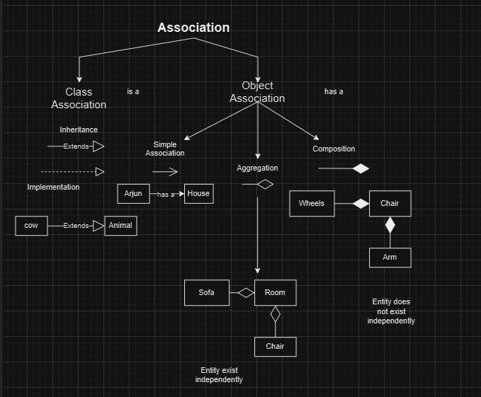

## Class digram -> static -> STructural UML

public +

private -

protected #

class divide into three parts 
    First class name
    Second part -> attributes -> + name: String
    Third part -> methods -> methodName(parameters): returnType

Hollow arrow -> inheritance / Implementation

abstract class <<abstractClass>>

Associations -> connection between two classes
    1. Association -> solid line
    2. Aggregation -> hollow diamond
    3. Composition -> filled diamond

Normal arrow -> Association / Dependency

Hollow arrow -> inheritance / Implementation

solid line -> Inheritance -> Strong coupling -> owns/keeps a reference -> object is stored as a field in the class

Dashed line -> Implementation -> weak coupling -> Use when a class only references another class inside methods.

arrow only ->uses / creates 

Solid line + hollow triangle → class extends class

Dashed line + hollow triangle → implements interface

Dashed line +  arrow  -> uses / creates  -> A temporarily uses B. Do not use if stored as field.

Solid line -> Class keeps reference of another class.

Empty diamond -> Aggregation -> weak ownership -> A has a B but B can exist without A. Example: Player can exist without Team. Team ◇---- Player

Filled diamond ->Composition -> strong ownership -> A has a B but B cannot exist without A. Example: House has a Room. Room cannot exist without House. House ◆---- Room

Both Side arrow -> Bidirectional Association -> A and B are aware of each other. Both hold references  Example: Student <--> Teacher 

font italic +{abstract} -> abstract method -> createParser(): FileParser {abstract}

italic class name -> abstract  class

