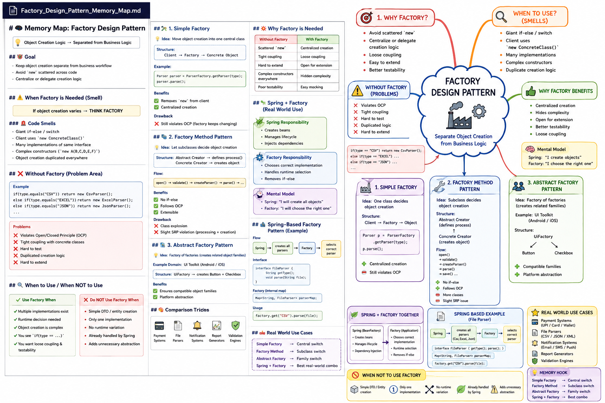

# 🧠 Factory Design Pattern – Memory Map

## 🌟 Core Idea

Object creation is separated from business logic to improve flexibility and maintainability.

---

## 🎯 Goal

Keep **object creation logic separate** from **stable business workflow**

---

## ⚠️ When to Use Factory (Code Smell)

* Giant `if-else` or `switch`
* Multiple implementations of same interface
* Client uses `new ConcreteClass()`
* Object creation logic is duplicated
* Complex constructor logic

👉 Rule:

> If object creation varies → THINK FACTORY

---

## ❌ Without Factory

```java
if(type.equals("CSV")) return new CsvParser();
else if(type.equals("EXCEL")) return new ExcelParser();
else if(type.equals("JSON")) return new JsonParser();
```

### Problems

* Violates OCP
* Tight coupling
* Hard to test
* Duplicated object creation

---

## 🏗️ 1. Simple Factory

### Idea

Centralize object creation in one class

### Flow

Client → Factory → Object

### Example

```java
Parser parser = ParserFactory.getParser(type);
parser.parse();
```

### Pros

* Removes `new` from client
* Centralized creation

### Cons

* Factory still needs modification (OCP violation)

---

## 🧱 2. Factory Method Pattern

### Idea

Let subclasses decide object creation

### Structure

Abstract Creator → Concrete Creator

### Flow

process()
→ createParser()
→ parse()

### Example

```java
ParserCreator creator = new PdfCreator();
creator.process();
```

### Pros

* No if-else
* Extensible (OCP satisfied)

### Cons

* Class explosion
* Slight SRP violation

---

## 🧩 3. Abstract Factory Pattern

### Idea

Factory of related factories

### Example Domain

UI Components (Android / iOS)

### Structure

UiFactory → Button + Checkbox

### Example

```java
UiFactory factory = new AndroidFactory();
factory.createButtonFactory();
factory.createCheckboxFactory();
```

### Benefits

* Ensures compatible objects
* Platform independence

---

## 🔥 Spring + Factory (Real World)

### Spring Role

* Creates beans
* Manages lifecycle

### Factory Role

* Chooses correct implementation at runtime

---

### Flow

Spring → creates all parsers
Factory → selects correct parser

---

### Example

```java
factory.get("CSV").parse(file);
```

---

## ⚙️ When to Use Factory

✔ Multiple implementations
✔ Runtime decision needed
✔ Complex creation logic
✔ if(type==...) logic present

---

## 🚫 When NOT to Use Factory

❌ Simple DTO/entity creation
❌ Only one implementation
❌ No runtime variation
❌ Already handled by Spring

---

## 🧠 Mental Models

Simple Factory → Central switch
Factory Method → Subclass switch
Abstract Factory → Family switch
Spring + Factory → Production pattern

---

## 🔥 Real Use Cases

* Payment systems
* File parsers
* Notification systems
* Report generators
* Validation engines

---

## 🧠 Final Hook

Spring = Object Creator
Factory = Object Selector

