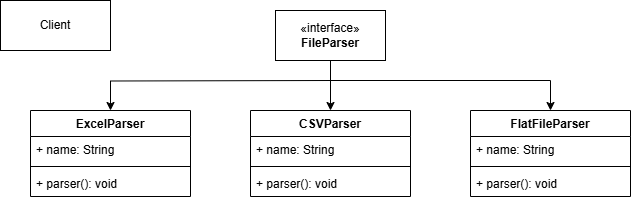

# Bad Design

## Problem Statement

Implement a File Parser that can perform different payment like Excel, csv, Flat file, 
The File Parser should be able to switch between these behaviors at runtime.

### UML Diagram


---

# Bad Code

## Step 1: Common Interface
```java

interface FileParserIn {
    void parse();
}

```
## Step 2: Implementations
```java
class CSVParserIn implements FileParserIn {
    @Override
    public void parse() {
        System.out.println("CSV Parsing");
    }
}

class ExcelParserIn implements FileParserIn {
    @Override
    public void parse() {
        System.out.println("Excel Parsing");
    }
}

class JSONParserIn implements FileParserIn {
    @Override
    public void parse() {
        System.out.println("JSON Parsing");
    }
}

class FlatFileParserIn implements FileParserIn {
    @Override
    public void parse() {
        System.out.println("Flat Parsing");
    }
}

```
## Step 3: Main Class
```java

public class FileParserBadDesign {

    static void main(String[] args) {
        System.out.println("Enter the file name: ");
        Scanner input = new Scanner(System.in);
        String fileName = input.nextLine();

        if(fileName.endsWith(".txt")){
            new FlatFileParserIn().parse();
        }else if (fileName.endsWith(".csv")){
            new CSVParserIn().parse();
        }else if (fileName.endsWith(".json")){
            new JSONParserIn().parse();
        }else if (fileName.endsWith(".xlxm")){
            new ExcelParserIn().parse();
        }


    }
}

```

<details> <summary>Why Beginner Developers Write This?</summary>
Easy to write if and else block
Simple to understand
Lack of centralized control
</details> ```