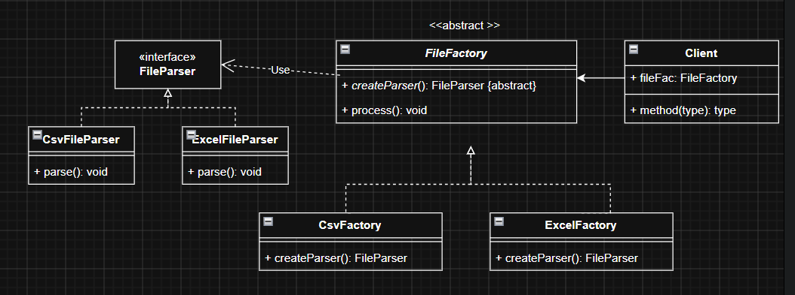

```
The Factory Design Pattern is a creational design pattern used when object creation logic 
becomes complex or varies based on conditions.
Instead of creating objects directly using new, you delegate creation responsibility to a Factory.

GOAL - Keep changing object creation separate from stable business workflow
```

Problems:

❌ Giant if-else

❌ Violates Open Closed Principle

❌ Client knows concrete classes

❌ Hard to test

❌ Object creation duplicated everywhere

```If object creation varies based on conditions → think Factory```

Without Factory client code :

```java

if(type.equals("CSV"))
      return  new CsvParser();
else if(type.equals("EXCEL")
        return new ExcelParser();
else if(type.equals("JSON"))
        return new JsonParser();
else if(type.equals("XML"))
        return new XmlParser();
else if(type.equals("PDF"))
        return new PdfParser();
else if(type.equals("FLAT"))
        return new FlatParser();
else
        throw new RuntimeException("Unsupported");
```

### 1. Simple Factory
Move creation logic outside (ParserFactory).

```java
interface Parser{
    void parse();
}

class PdfParser implements Parser{
    public void parse(){
        System.out.println("PDF parsing");
    }
}

class CsvParser implements Parser{
    public void parse(){
        System.out.println("CSV parsing");
    }
}
```

```java
class ParserFactory{

    public static Parser getParser(String type){

        if(type.equals("PDF"))
            return new PdfParser();

        if(type.equals("CSV"))
            return new CsvParser();

        throw new RuntimeException("Invalid type");
    }
}
```

```java
public class FileProcessor {

    public void process(String type){

        Parser parser = ParserFactory.getParser(type);

        parser.parse();
    }
}
```


What changed?

Before:

    new CsvParser()
    new ExcelParser()
    new JsonParser()

Client knew everything.

After:

    Parser parser=ParserFactory.getParser(type);

Client only knows: Parser -> Not implementation.

This is called loose coupling.

Problems:

Violates Open Closed Principle. Adding new parser like flat file we need to modify the factory if(type.equals("FlatFile"))

### 2. Factory Method Pattern
Move object creation responsibility to subclasses.

Instead of one giant factory, each subclass knows how to create its object.

1. Create an interface and concrete implementations for each parser type.
2. Create concrete creator for each parser type.
3. Create an abstract creator that defines the factory method and process method.




```java
interface Parser{
    void parse();
}

class PdfParser implements Parser{
    public void parse(){
        System.out.println("PDF parsing");
    }
}

class CsvParser implements Parser{
    public void parse(){
        System.out.println("CSV parsing");
    }
}
```

```java
abstract class ParserCreator{

    protected abstract Parser createParser();

    void process(){

        Parser p=createParser();

        p.parse();
    }
}

```

Concrete creators:

```java
class PdfCreator extends ParserCreator{

    Parser createParser(){
        return new PdfParser();
    }
}

class CsvCreator extends ParserCreator{

    Parser createParser(){
        return new CsvParser();
    }
}
```
Client code:

```java

ParserCreator creator=new PdfCreator();
creator.process();

```

#### Another Example

```java
abstract class FileProcessor {

    final void process(){

        open();

        validate();

        Parser p=createParser();

        p.parse();

        save();

        archive();

        sendNotification();
    }

    abstract void open();

    abstract void validate();

    abstract Parser createParser();

    void save(){
        System.out.println("saving");
    }

    void archive(){
        System.out.println("archiving");
    }

    void sendNotification(){
        System.out.println("notify");
    }
}
```

CSV implementation
```java
class CsvProcessor extends FileProcessor{

    void open(){
        System.out.println("Open CSV");
    }

    void validate(){
        System.out.println("Validate CSV");
    }

    Parser createParser(){
        return new CsvParser();
    }
}

```
Client Code
```java

FileProcessor processor=new CsvProcessor();

processor.process();

```
Output: 
```output
Open CSV
Validate CSV
CSV Parsing
saving
archiving
notify

```

### Advantage:
1. No huge if-else.
2. No changes to existing code.(OCP)

### Disadvantage:
Break SRP - CsvProcessor is responsible for both processing and creating parser.

### 3. Abstract Factory Pattern
When you have multiple related factories, you can use Abstract Factory to group them together.


Product interfaces

```
interface Button {
    void createButton();
}

interface Checkbox{
    void createCheckbox();
}
```
Implementations

```java

// Android Implementation
class AndroidButton implements Button {
    @Override
    public void createButton() {
        System.out.println("Creating Android Button...");
    }
}
class AndroidCheckbox implements Checkbox {
    @Override
    public void createCheckbox() {
        System.out.println("Creating Addroid Checkbox...");
    }
}

class IosButton implements Button {
    @Override
    public void createButton() {
        System.out.println("Creating IOS Button...");
    }
}

class IosCheckbox implements Checkbox {
    @Override
    public void createCheckbox() {
        System.out.println("Creating IOS Checkbox...");
    }
}
```

Abstract Factory

```java
interface UiFactory{
    Button createButtonFactory();
    Checkbox createCheckboxFactory();
     
}
```

Concrete factories:

```java
class AndroidFactory implements UiFactory {
    @Override
    public Button createButtonFactory() {
        return new AndroidButton();
    }

    @Override
    public Checkbox createCheckboxFactory() {
        return new AndroidCheckbox();
    }
    
}

class IOSFactory implements UiFactory {
    @Override
    public Button createButtonFactory() {
        return new IosButton();
    }
    @Override
    public Checkbox createCheckboxFactory() {
        return new IosCheckbox();
    }
}
```

Client code
```java
public class AbstractFactory {

    static void main(String[] args) {

        UiFactory android = new AndroidFactory();
        android.createButtonFactory().createButton();
        android.createCheckboxFactory().createCheckbox();

    }
}
```

### Interview memory trick

Simple Factory → One class decides object creation

Factory Method → Child class decides object creation

Abstract Factory → Factory creates related object families


### Why do we need Factory?

| Benefits                    | Without Factory                                                                                                                                        | With Factory                                                                                |
|-----------------------------|--------------------------------------------------------------------------------------------------------------------------------------------------------|:--------------------------------------------------------------------------------------------|
| Centralized object creation | Object creation logic is scattered across the codebase.<br/><br/>Instead of:<br/><br/>`new Car()`<br/>`new Car()`<br/>`new Car()`<br/><br/>everywhere. | Object creation logic is centralized.<br/><br/>`CarFactory.create()`<br/><br/>Single place. |
| Hides complexity            | Imagine object creation:<br/><br/>`Payment payment =new CreditCardPayment(db,logger,cache,validator,config);`<br/><br/>Ugly.                           | Factory:<br/><br/>`Payment payment =PaymentFactory.create("CARD");` <br/><br/> Cleaner      |
| Open for extension          | Without factory:<br/><br/>`FileProcessor`<br/>`ServiceA`<br/>`ServiceB`<br/>`ServiceC`<br/><br/>Need modifications everywhere.                         | With factory: <br/><br/>`Only: ParserFactory changes.`                                      |
| Better testing              | Without:<br/<<br/>`new EmailService()` <br/>Hard to mock.                                                                                              | With:<br/><br/>`EmailServiceFactory.get()`<br/><br/>Can replace with fake implementation.   |


### Smell to identify Factory need

| Checkpoint | Typical signs in code |
|------------|------------------------|
| Is object creation changing? | `if(type=="CSV")`<br/>`if(type=="EXCEL")`<br/>`if(type=="JSON")` |
| Do I create many implementations? | `UPIPayment`<br/>`CardPayment`<br/>`WalletPayment` |
| Do clients know concrete classes? | `new CardPayment()`<br/>`new UPIPayment()` |
| Is object creation becoming complex? | Many constructor parameters:<br/>`new A(B,C,D,E,F,G)` |

If yes -> Factory candidate.

### Smell Not to use Factory
| Checkpoint | Typical signs in code                                                |                                                            |
|------------|----------------------------------------------------------------------|------------------------------------------------------------|
| Object creation is simple | `new Car()`<br/>`User user = new User("John",25);`<br/>`new Order()` | You added: <br/>extra class<br/> extra abstraction <br/>extra indirection |
| No variations in object creation | Only one implementation                                              | No runtime choice.<br/>No complexity.<br/>No benefit.      |
|DTOs/entities| Object creation is already simple <br/>`new Customer()`              |Factory adds noise.|
|Spring already does it| In Spring <br/>`@Autowired`<br/>` UserService service;`                            |Spring's container is already acting as a factory.<br/>You'd be wrapping a factory around another factory.|
|hiding one line|new User()|Factory adds noise.<br/>No benefit.|

### Spring already has BeanFactory/ApplicationContext. Why create our own Factory?

```
Spring Factory creates and manages beans.

Application Factory selects the correct implementation at runtime based on business rules.
```

#### Factory Pattern with Spring — File Parser Example

#### Requirement

Need different parsers:

- CSV → `CsvParser`
- Excel → `ExcelParser`
- JSON → `JsonParser`

---

#### Step 1: Common Interface

```java
interface FileParser {
    void parse(String file);
}
```

---

#### Step 2: Implementations

```java
@Component
class CsvParser implements FileParser {

    @Override
    public void parse(String file){
        System.out.println("Parsing CSV");
    }
}

@Component
class ExcelParser implements FileParser {

    @Override
    public void parse(String file){
        System.out.println("Parsing Excel");
    }
}

@Component
class JsonParser implements FileParser {

    @Override
    public void parse(String file){
        System.out.println("Parsing JSON");
    }
}
```

---

### What Spring Already Does

Spring automatically creates parser objects.

Internally think of Spring as:

```java
new CsvParser();

new ExcelParser();

new JsonParser();
```

Spring responsibility:

✅ Creates beans  
✅ Dependency Injection  
✅ Lifecycle management

Object creation problem is already solved.

---

### Actual Problem

Runtime input:

```java
inputFile = "txn.csv"
```

Need:

```java
CsvParser
```

For:

```java
report.xlsx
```

Need:

```java
ExcelParser
```

Spring **cannot automatically decide**:

> "Given txn.csv → choose CsvParser"

This runtime selection logic belongs to application code.

---

### Without Factory

```java
@Service
class FileService {

    @Autowired
    CsvParser csv;

    @Autowired
    ExcelParser excel;

    @Autowired
    JsonParser json;

    void process(String fileType){

        if(fileType.equals("CSV"))
            csv.parse();

        else if(fileType.equals("EXCEL"))
            excel.parse();

        else if(fileType.equals("JSON"))
            json.parse();
    }
}
```

---

### Problems

❌ Giant if-else

❌ Every new parser modifies service

❌ Violates Open Closed Principle

❌ Runtime selection mixed with business logic

Spring solved object creation.

<h3>Spring did NOT solve runtime strategy selection.</h3>

---

### Better Solution → Spring + Factory

### Parser Contract

```java
interface FileParser {

    String getType();

    void parse(String file);
}
```

---

### Parser Implementation

```java
@Component
class CsvParser implements FileParser {

    @Override
    public String getType() {
        return "CSV";
    }

    @Override
    public void parse(String file){
        System.out.println("CSV Parsing");
    }
}
```

Same for:

- ExcelParser
- JsonParser

---

### Factory

```java
@Component
@RequiredArgsConstructor
class ParserFactory {

    private final List<FileParser> parsers;

    private Map<String, FileParser> parserMap;

    @PostConstruct
    void init(){

        parserMap =
            parsers.stream()
                    .collect(
                        Collectors.toMap(
                            FileParser::getType,
                            Function.identity()
                        )
                    );
    }

    public FileParser get(String type){

        return parserMap.get(type);
    }
}
```

---

### Usage

```java
@Service
@RequiredArgsConstructor
class FileService {

    private final ParserFactory factory;

    public void process(String type){

        FileParser parser =
                factory.get(type);

        parser.parse(type);
    }
}
```

---

## Responsibilities Separation

### Spring Responsibility

- Creates parser beans
- Manages lifecycle
- Injects dependencies

---

### Factory Responsibility

- Chooses correct parser
- Handles runtime selection
- Removes if-else

---

### Mental Model

Spring says:

```text
"I created these objects."
```

Factory says:

```text
"Out of these objects choose the correct one."
```

---

## Rules of Thumb:


Use Spring for creation + dependency management

Use Factory for business-driven runtime resolution

This combination is very common in production systems:

Payment processors
Notification channels
File parsers
Export handlers
Validation engines
