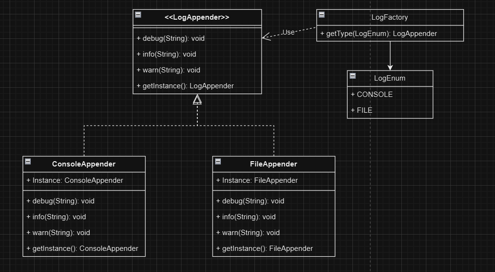
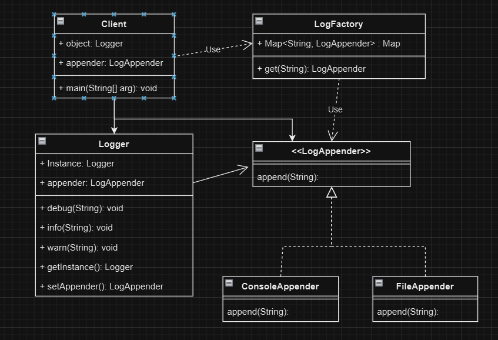

### Goal:

Write logs in file and console and later can be db.

### UML
We will at startegy design to support multiple appenders and open/closed principle to add new appenders without modifying logger.

Singleton + Strategy


#### Problem 

1. Singleton Should NOT Be on Every Appender

If FileAppender is singleton: impossible to support multiple files.

new FileAppender("app.log")

new FileAppender("error.log")

2. Factory Depends on Enum (Tightly Coupled)

#### Solution 1:



Add Logger class having one object in complete application with setter to add appenders. Its help to remove singleton from appender.

#### Problem:
1. Client knows too much
* factory exists
* appender exists
* logger needs setter
* appender type names

2. Logs can't be written in multiple file

This violates:

* Encapsulation
* low coupling
* Least Knowledge Principle

Solution 2: Try to hide factory and appender from client to achieve Least Knowledge Principle

Problem :
This mixes:

* lifecycle responsibility
* configuration responsibility
* Logs can't be written in multiple file


Solution 3: Create object using Builder pattern and hide factory and appender from client to achieve Least Knowledge Principle.


### Flow Diagram

```
Application starts
       ↓
Singleton Logger created
       ↓
ConsoleAppender added
       ↓
FileAppender added
       ↓
logger.log("message")
       ↓
Logger sends message to ALL appenders
       ↓
Console writes log
       ↓
File writes log
```

### Design Patterns
| Pattern               | Where Used                                 |
| --------------------- | ------------------------------------------ |
| Singleton             | Logger                                     |
| Strategy              | Different appenders                        |
| Open/Closed Principle | Add new appenders without modifying Logger |
| Composition           | Logger contains appenders                  |
