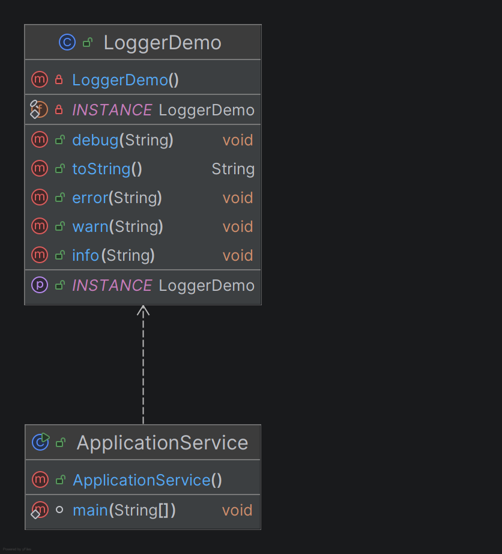

### Goal:
One logger shared across application

### UML:



### Tradeoffs:
We used Eager Initialization to create the instance at the time of class loading since:

1. Object is lightweight (like Logger, Config)
2. You are sure it will always be used 
3. You want simplicity over optimization
4. Thread safety is inherently handled by JVM during class loading.

### Flow Diagram:

#### Step 1: Class Loading Phase
```
JVM loads Logger class
    ↓
Static variables are initialized immediately
    ↓ 
INSTANCE = new Logger()
    ↓
Constructor executed once
    ↓
Singleton instance stored in memory
```
#### Step 2: Accessing the Logger
```
Any class calls Logger.getInstance()
        ↓
Return already created INSTANCE
        ↓
No object creation happens here
```
