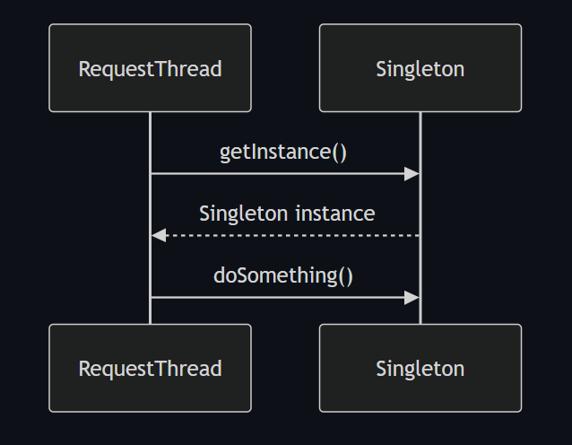

# Singleton Design Pattern
Allow object creation only once and provide a global point of access to that object.

## Think:
One class → One object → Shared everywhere



### Key points:

1. Behind the scenes, if we used shared instances then we need Singleton Design Pattern.
2. Object creation is expensive so we want to reuse the same instance across the application.
3. Singleton objects are immutable and stateless
4. Spring Beans are singleton by default

### Core Idea

1. Make constructor private to prevent instantiation from outside the class.
```java
 private Singleton(){
        System.out.println("Singleton instance created");
    }
```
2. Create a method which allow access to a single object and returns the instance to the caller.
```java
public static Singleton getInstance() {
        if(instance == null) {
            instance = new Singleton();
        }
        return instance;
    }
```
3. An attribute inside the class to hold the reference of single instance of the class.
```java
  static Singleton instance;
```
Create object internally:
- Eager initialization: Create the instance at the time of class loading.
- Lazy initialization: Create the instance when it is requested for the first time.
- Thread-safe initialization: Ensure that the instance is created in a thread-safe manner to avoid multiple instances in a multi-threaded environment.
- Double-checked locking: A more efficient way to ensure thread safety while creating the instance.
- Bill Pugh Singleton Design: Uses a static inner helper class to create the instance, ensuring thread safety and lazy initialization.
- Enum Singleton Design: Uses an enum to create a singleton instance, which is thread-safe and provides serialization guarantees.


### Real world examples of Singleton Design Pattern:
Logger class

Configuration Manager

Database Connection Pool

Thread Pool

Cache manager

Application settings

# code

## Basic Singleton (Lazy Initialization)
```java
public class SingletonDesignPattern {

    static void main(String[] args) {
        Singleton s1= Singleton.getInstance();
        Singleton s2= Singleton.getInstance();

        if(s1==s2)
            System.out.println("Both are same instance");
        else
            System.out.println("Both are different instance");
    }
}

class Singleton{

    static Singleton instance;

    private Singleton(){
        System.out.println("Singleton instance created");
    }
    public static Singleton getInstance() {
        if(instance == null) {
            instance = new Singleton();
        }
        return instance;
    }
}

```

### Problem

Not thread safe.

## Eager Initialization
Create object while loading the class.

```java

public class EagerLoading {
    static void main(String[] args) {
        EagerSingleton s1 = EagerSingleton.getInstance();
        EagerSingleton s2 = EagerSingleton.getInstance();

        if(s1==s2)
            System.out.println("EagerSingleton instances are the same");
        else
            System.out.println("EagerSingleton instances are not the same");

    }
}

class EagerSingleton {
    private static final EagerSingleton instance = new EagerSingleton();

    private EagerSingleton() {
        // Private constructor to prevent instantiation
        System.out.println("EagerSingleton instance created");
    }

    public static EagerSingleton getInstance() {
        return instance;
    }
}

```

### Advantages:

✔ Thread safe

✔ Simple

### Disadvantage:

Object created even if never used.

No runtime parameter passing possible.

## Synchronized Method

Create synchronized method to make thread safe

```java
public class SynchronisedSingleton {

    static void main(String[] args) {
        SyncSingleton s1 = SyncSingleton.getInstance();
        SyncSingleton s2 = SyncSingleton.getInstance();

        if(s1==s2)
            System.out.println("SyncSingleton instances are the same");
        else
            System.out.println("SyncSingleton instances are not the same");

    }
}

class SyncSingleton{

    public static SyncSingleton instance;

    private SyncSingleton(){
        System.out.println("SyncSingleton instance created");
    }
    public static synchronized  SyncSingleton getInstance(){
        if(instance==null)
            instance=new SyncSingleton();
        return instance;
    }

}

```

### Advantages:
Thread Safe.


### Disadvantages:
Every call locks method.

Slow.

### Double Checked Locking

```java
public class DoubleCheckedLocking {
    static void main(String[] args) {
        DoubleChecking s1 = DoubleChecking.getInstance();
        DoubleChecking s2 = DoubleChecking.getInstance();

        if(s1==s2)
            System.out.println("DoubleChecking instances are the same");
        else
            System.out.println("DoubleChecking instances are not the same");

    }
}

class DoubleChecking{
    public static volatile  DoubleChecking instance;

    private DoubleChecking(){
        System.out.println("DoubleChecking instance created");
    }
    public static DoubleChecking getInstance(){
        if(instance==null){
            synchronized (DoubleCheckedLocking.class){
                if(instance==null){
                    instance = new DoubleChecking();
                }
            }
        }
        return instance;
    }
}


```

### Advantages:

✔ Thread safe

✔ Better performance

## Bill Pugh Singleton Design **Best Solution**
Uses static inner helper class.

```java
public class BillPugh
{
    static void main(String[] args) {
        BillPughSignleton s1 = BillPughSignleton.getInstance();
        BillPughSignleton s2 = BillPughSignleton.getInstance();

        if(s1==s2)
            System.out.println("BillPughSignleton instances are the same");
        else
            System.out.println("BillPughSignleton instances are not the same");

    }
}

class BillPughSignleton{

    private BillPughSignleton(){
        System.out.println("BillPughSignleton constructor called");
    }

    private static class Helper{
        public static final BillPughSignleton instance=new BillPughSignleton();
    }

    public static BillPughSignleton getInstance(){
        return Helper.instance;
    }

}

```

### Advantages:

✔ Lazy loaded
✔ Thread safe
✔ No synchronization overhead
✔ Cleaner

### Internal working

Step by step:

Step 1: Outer class loads first. the inner class not loaded.

When JVM loads: BillPughSignleton s1 Only this class loads: BillPughSignleton

Helper class not loaded.

So object is not created.

Lazy loading achieved ✔

Step 2: First call to getInstance()  BillPughSignleton.getInstance() inside this  return Helper.instance;

Now JVM sees: Helper class first time. so JVM load Helper class and During class loading JVM initializes:

instance=new BillPughSignleton(); Object created only now.

Lazy loading ✔

Step 3: JVM guarantees class initialization happens once

Java specification guarantees:

Class initialization is synchronized internally

Only one thread initializes a class

Other threads wait

Think:
```
Thread1 → load Helper
Thread2 → load Helper
Thread3 → load Helper
```

JVM internally does:
```
Lock Helper class

Thread1 initializes INSTANCE

Unlock
```
Other threads receive same object:
```
Thread2 → existing instance
Thread3 → existing instance
```
No race condition.

Thread safety ✔

So we avoided:
```
synchronized getInstance()
```
because JVM already synchronizes class loading.

### Advantages:
Best performance.
Thread Safe
Lazy Initialization

In Synchronized method  every call acquire lock and release lock

In Bill Pugh Singleton Design Lock only once during class initialization. Subsequent calls return existing instance without acquiring lock. So better performance.


## Enum Singleton